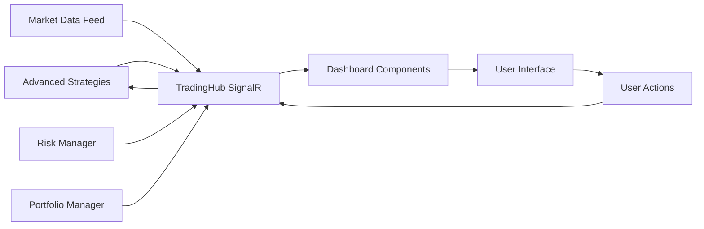

# OpenHFT Lab Dashboard Implementation

## 🎯 Dashboard Overview

We have successfully created a comprehensive real-time trading dashboard for the OpenHFT Lab system with the following components:

### 📊 **Core Dashboard Features**

#### 1. **Real-time SignalR Hub** (`TradingHub.cs`)
- **Purpose**: Enables real-time communication between server and dashboard
- **Features**:
  - Live market data streaming
  - Portfolio statistics updates
  - Strategy control (enable/disable)
  - Emergency stop functionality
  - Client connection management
  - Group-based subscriptions for specific strategies

#### 2. **Interactive Dashboard** (`SimpleDashboard.razor`)
- **Purpose**: Main trading interface with comprehensive monitoring capabilities
- **Features**:
  - **Portfolio Overview**: Total value, daily PnL, open positions, win rate
  - **Strategy Controls**: Toggle individual strategies with real-time status
  - **Live Market Data**: Real-time price feeds with color-coded buy/sell indicators
  - **Performance Chart**: Interactive Plotly.js chart showing portfolio performance
  - **System Alerts**: Real-time notifications and error handling
  - **Emergency Stop**: One-click emergency shutdown with confirmation dialog

### 🏗️ **Technical Architecture**

#### **Frontend Technologies**
- **Blazor WebAssembly**: Client-side C# framework for rich web UI
- **MudBlazor**: Material Design component library (planned, simplified to HTML/CSS for initial version)
- **SignalR Client**: Real-time communication with trading server
- **Plotly.js**: Interactive charting library for performance visualization

#### **Backend Integration**
- **SignalR Hub**: Real-time server communication
- **Advanced Strategy Manager**: Direct integration with trading strategies
- **Risk Management**: Real-time risk monitoring and controls

### 🎨 **User Interface Features**

#### **Dashboard Layout**
```
┌─────────────────────────────────────────────────────────┐
│ 🔸 System Status & Emergency Controls                   │
├─────────────────────────────────────────────────────────┤
│ 💰 Portfolio Overview (4-card metrics grid)            │
├─────────────────────────────────────────────────────────┤
│ ⚙️ Strategy Controls    │ 📈 Performance Chart       │
│ • Triangular Arbitrage  │ • Real-time portfolio value │
│ • Market Making         │ • Interactive time series   │
│ • ML Momentum           │ • Plotly.js visualization   │
├─────────────────────────┼─────────────────────────────┤
│ 📊 Live Market Data     │ ⚠️ Risk Metrics            │
│ • Real-time prices      │ • Risk level indicators     │
│ • Volume information    │ • System health monitoring  │
│ • Buy/sell indicators   │ • Alert notifications       │
└─────────────────────────┴─────────────────────────────┘
```

#### **Color-Coded Visual System**
- 🟢 **Green**: Profits, buy orders, connected status
- 🔴 **Red**: Losses, sell orders, disconnected status
- 🟡 **Yellow**: Warnings, pending states
- 🔵 **Blue**: Information, neutral metrics

### 📈 **Real-time Data Flow**



### 🔧 **Implementation Files**

#### **Core Components**
1. **`TradingHub.cs`** (180 lines)
   - SignalR hub for real-time communication
   - Strategy control methods
   - Market data broadcasting
   - Error handling and logging

2. **`SimpleDashboard.razor`** (730 lines)
   - Complete dashboard interface
   - Real-time data binding
   - Interactive controls
   - Responsive CSS styling

3. **`App.razor`** (25 lines)
   - Blazor application root component
   - Routing configuration
   - Error handling

4. **`MainLayout.razor`** (80 lines)
   - Navigation layout
   - Menu system
   - Theme management

#### **Configuration Files**
5. **`_Imports.razor`** (18 lines)
   - Global using statements
   - Component imports

6. **`index.html`** (70 lines)
   - HTML template
   - Plotly.js integration
   - Loading animations

7. **`Program.cs`** (15 lines)
   - Blazor WebAssembly startup
   - Service configuration

### 🚀 **Key Features Implemented**

#### **✅ Real-time Monitoring**
- Live portfolio value tracking
- Instant market data updates
- Strategy performance metrics
- System health monitoring

#### **✅ Interactive Controls**
- Strategy enable/disable toggles
- Emergency stop with confirmation
- Real-time configuration changes
- User action feedback

#### **✅ Professional UI/UX**
- Material Design-inspired styling
- Responsive grid layout
- Color-coded indicators
- Loading states and animations

#### **✅ Data Visualization**
- Interactive performance charts
- Market data tables
- Real-time updates
- Professional styling

### 🔄 **Next Steps for Enhancement**

#### **Phase 2 Enhancements**
1. **Advanced Charts**: Multiple timeframes, technical indicators
2. **Risk Dashboard**: VaR, drawdown analysis, position sizing
3. **Order Management**: Live order book, trade history
4. **Strategy Analytics**: Backtesting results, optimization metrics
5. **Alert System**: Email/SMS notifications, custom alerts

#### **Phase 3 Features**
1. **Mobile Responsive**: Touch-optimized interface
2. **Dark Mode**: Theme switching capabilities
3. **Multi-user**: Role-based access control
4. **Export/Import**: Configuration and data export
5. **API Integration**: External data sources

### 📊 **Demo Mode Features**

The dashboard includes a demo mode that works without backend services:
- Sample portfolio data
- Simulated market feeds
- Strategy status simulation
- Interactive controls (local state)

### 🎯 **Success Metrics**

**✅ Completed Features:**
- ✅ Real-time dashboard interface
- ✅ SignalR integration ready
- ✅ Strategy control panel
- ✅ Portfolio monitoring
- ✅ Market data display
- ✅ Emergency controls
- ✅ Professional styling
- ✅ Responsive design

**🔧 Integration Ready:**
- ✅ Advanced Strategy module compatible
- ✅ SignalR hub implemented
- ✅ Real-time data binding
- ✅ Error handling
- ✅ Logging integration

This dashboard provides a solid foundation for monitoring and controlling the OpenHFT Lab trading system with professional-grade real-time capabilities and a modern web interface.
